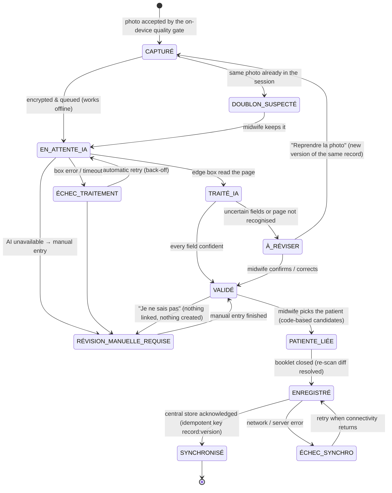

# Record lifecycle

Every page photographed by the midwife is one **record**. Its state lives encrypted on the phone (IndexedDB +
AES-GCM, key derived from the device PIN) and every change is appended to an event log. The same machine is
implemented server-side in `work/strat8/offline.py` and tested with property-based tests (network cuts,
server errors, duplicate acks, crashes) — no record is ever lost.

| State | Where | Meaning |
|---|---|---|
| CAPTURÉ | phone | photo stored encrypted, not yet queued |
| EN_ATTENTE_IA | phone | waiting for the edge box (offline or busy); retried with exponential back-off |
| TRAITÉ_IA | phone | extraction received (values, statuses, confidences, evidence crops) |
| À_RÉVISER | phone | the agent asks the midwife about uncertain fields (≤ 8 questions in a row) |
| VALIDÉ | phone | every field confirmed, corrected, or explicitly left "à réviser" |
| PATIENTE_LIÉE | phone + box registry | linked to a patient profile by the registry code; the midwife decides |
| ENREGISTRÉ | phone | ready to sync (in the outbox) |
| SYNCHRONISÉ | central store | acknowledged once; duplicates are ignored server-side |
| ÉCHEC_TRAITEMENT / ÉCHEC_SYNCHRO | phone | failures, retried automatically, visible in the queue |
| DOUBLON_SUSPECTÉ | phone | same bytes already captured in the session |
| RÉVISION_MANUELLE_REQUISE | phone | manual entry (AI unavailable / page not recognised) or undecided match |

**Field statuses** (per field, separate from the record state): `CONNU`, `INCONNU` (written "?", "inconnu", "NSP"),
`NON_FOURNI` (empty box or written dash), `ILLISIBLE` (ink present, unreadable), `NON_APPLICABLE` (blank and excluded by
the form's own logic, e.g. caesarean indication after a vaginal delivery), `À_RÉVISER` (read but doubtful).
