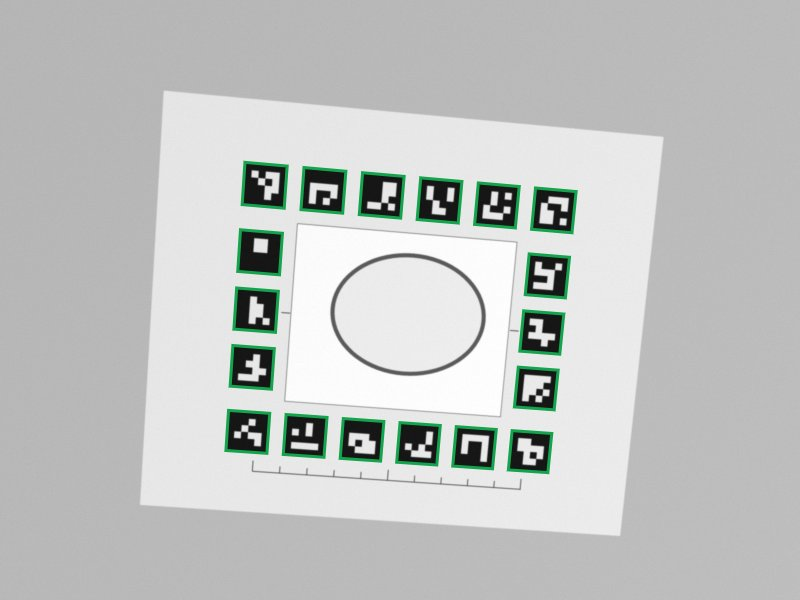
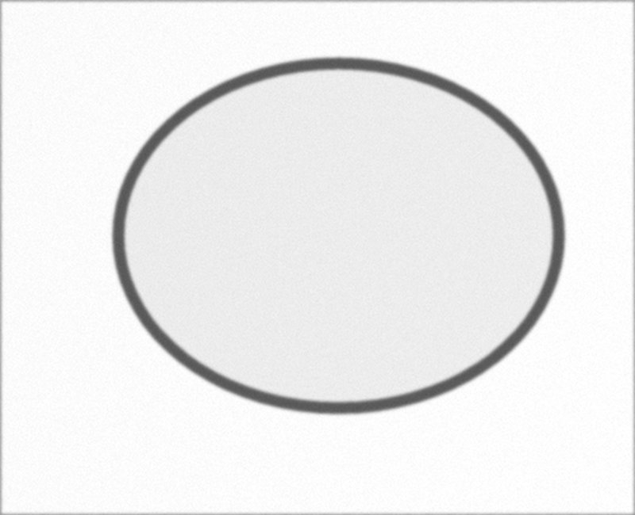
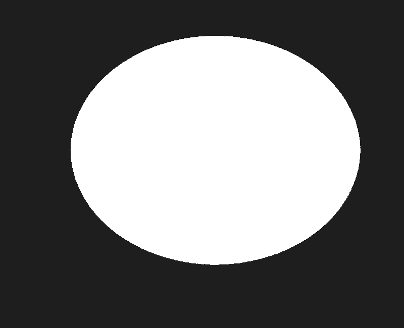
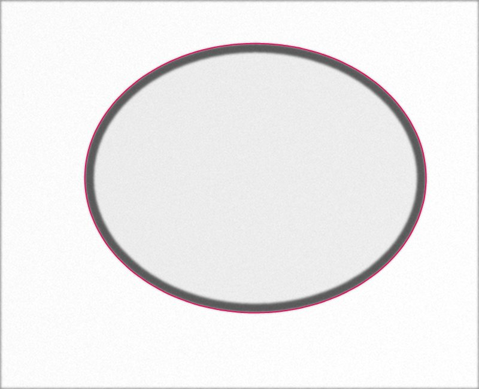

# Pas à pas : une photo et ses images intermédiaires

> Retour au [`README`](../README.md). L'app montre les mêmes images pour la dernière photo mesurée : écran « Pas à pas », avec la durée de chaque étape sur le téléphone utilisé.

Les images ci-dessous sont à produire avec un vrai verre sur le dispositif de capture. Emplacements réservés dans `docs/img/` ; tant qu'un fichier n'existe pas, la ligne reste `À COMPLÉTER`.

> **En attendant la photo réelle : exemple sur une photo synthétique.** Les images de ce cadre sortent de l'écran « Pas à pas » de **l'app en ligne** (https://francklin9999.github.io/codeml2026/, Chrome, écran de téléphone), pour la photo `rig/out/fixtures/fixture_04_ellipse_medium.png` : une feuille de référence dessinée par `rig/make_board.py` avec une ellipse de 57 × 45 mm à bord sombre de 1,5 mm, inclinée de 5°, floutée et bruitée. Ce n'est **pas** une photo de téléphone : elle montre le fonctionnement, pas la justesse. Script : `app/bench/steps_capture.mjs`.
>
> | 1. Référence détectée | 2. Image redressée | 3. Masque (méthode classique) | 4. Contour |
> |---|---|---|---|
> |  |  |  |  |
>
> Résultat affiché : A 57,0 mm, B 45,0 mm, périmètre 160,7 mm (vérité de la photo synthétique : 57 × 45 mm). Durées affichées par l'app sur le PC : redressement 2 229 ms (dont chargement d'OpenCV 393 ms), segmentation 763 ms, mesure 267 ms. Écran résultat : [`img/pas-a-pas-synth-5.jpg`](img/pas-a-pas-synth-5.jpg).

| | |
|---|---|
| Verre photographié | `À COMPLÉTER` (identifiant, description) |
| Téléphone | `À COMPLÉTER` |
| Valeurs au pied à coulisse | A `À COMPLÉTER` mm, B `À COMPLÉTER` mm |

## 1. Référence détectée

Image : `docs/img/pas-a-pas-1.png` (`À COMPLÉTER`)

La photo d'origine, avec les marqueurs de la feuille tracés en vert là où le calcul les place.
Si les carrés verts recouvrent les marqueurs imprimés, la feuille est bien repérée ; avec moins de 4 marqueurs, l'app refuse la photo.

## 2. Image redressée

Image : `docs/img/pas-a-pas-2.png` (`À COMPLÉTER`)

La fenêtre de 80 × 65 mm vue de dessus, à 10 pixels par millimètre (800 × 650 pixels).
L'échelle vient des marqueurs et de la règle vérifiée au pied à coulisse ; une photo trop inclinée ou floue est refusée à cette étape.

## 3. Masque du verre

Image : `docs/img/pas-a-pas-3.png` (`À COMPLÉTER`)

En blanc, la surface que l'app attribue au verre ; la légende dit quelle méthode l'a produite (« classique » ou « modèle »).
La méthode classique cherche le bord sombre du verre rétro-éclairé ; elle refuse un reflet trop fort ou un verre qui dépasse de la fenêtre.

## 4. Contour

Image : `docs/img/pas-a-pas-4.png` (`À COMPLÉTER`)

Le contour mesuré, tracé sur l'image redressée : c'est l'image de contrôle.
Le contour est une liste de 720 points en millimètres, placée sur le bord extérieur du verre et calculée à une fraction de pixel (justesse sur un vrai verre : `À COMPLÉTER`).

## 5. Mesures

Image : `docs/img/pas-a-pas-5.png` (`À COMPLÉTER`, écran « résultat »)

A et B sont la largeur et la hauteur du rectangle qui enserre le contour, côtés parallèles aux axes de la feuille (système boxing) ; le périmètre est la longueur du contour.
Avec plusieurs photos, l'app affiche aussi l'écart entre elles sur A et sur B.

| Mesure | App | Pied à coulisse | Écart |
|---|---|---|---|
| A (mm) | `À COMPLÉTER` | `À COMPLÉTER` | `À COMPLÉTER` |
| B (mm) | `À COMPLÉTER` | `À COMPLÉTER` | `À COMPLÉTER` |
| Périmètre (mm) | `À COMPLÉTER` | sans objet | sans objet |

## Et ensuite

Le même contour sert au tracé SVG à l'échelle 1:1 et à la monture : chaque cercle est le contour décalé du jeu, relié à l'autre par le pont. Le montage du dispositif est décrit dans [`DISPOSITIF_CAPTURE.md`](DISPOSITIF_CAPTURE.md).
